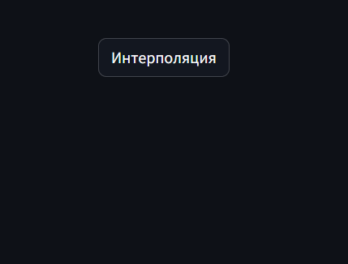
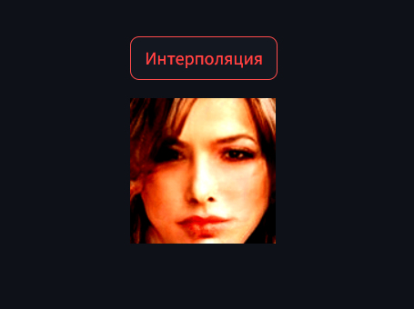

# Вторая практическая работа

__Выполнил__ - Бакланов Иван Леонидович, студент группы РИМ 130963.

Для исполнения кода необходимо клонировать проект и исполнить команды:

```cd demo-ml/practice_2/baklanov```

```pip install numpy tensorflow tensorflow_hub imageio ipython absl-py streamlit```

Файл requirements.txt содержит версии пакетов, на которых тестировалась праграмма.

Можно провести установку в виртуальное окружение python следующим образом:

```pip install -r requirements.txt```

Для запуска программы нужно выполнить:

```streamlit run main.py```

Для генерации интерполяции между двумя случайными изображениями необходимо нажать на кнопку __Интерполяция__:



Ниже будет выведен результат. Можно провести повторную генерацию уже с другим результатом:


