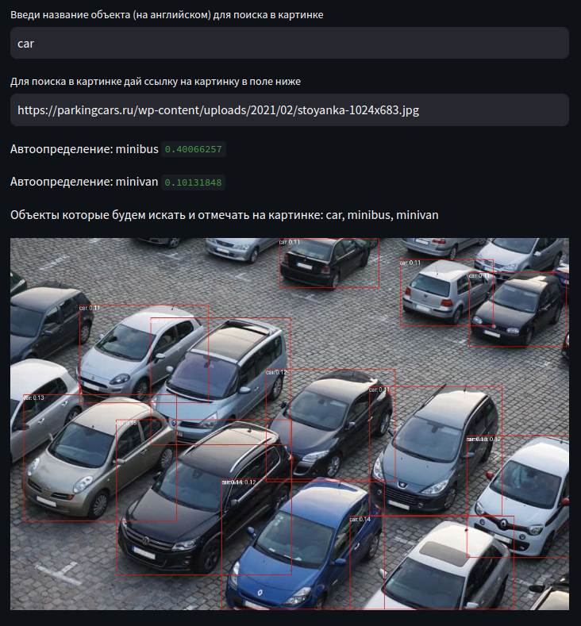
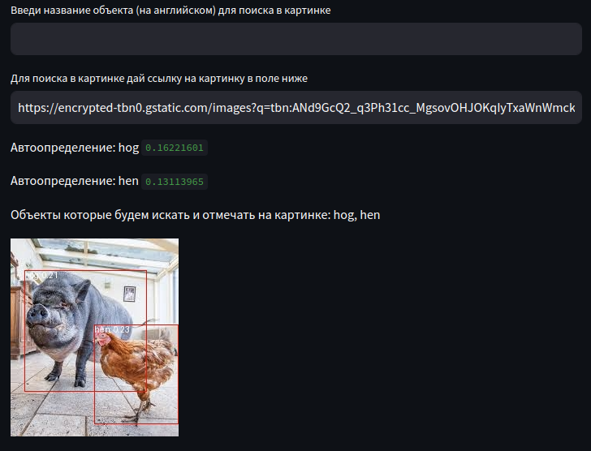
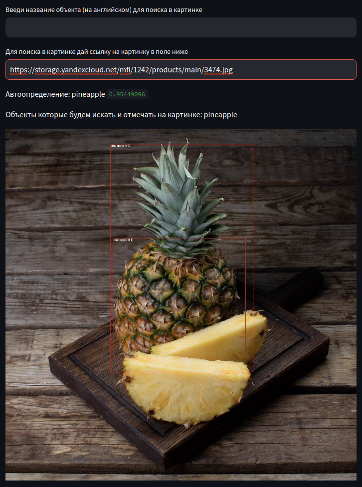

# Практическое задание №2
__Выполнил:__ *Домченко Максим*

__Студент группы:__ *РИМ-130962*

__Задача:__ *Поиск объектов в изображении*

__Описание:__

* Выбрана обученная модель `google/owlvit-base-patch32`
с сайта [huggingface.co](https://huggingface.co/google/owlvit-base-patch32)
* Модель принимает на вход изображение и название объекта(объектов) которое необходимо найти
* На выходе модель отдаёт массив найденных объектов, каждый объект содержит:
  * `score` - вероятность определения объекта
  * `label` - название объекта
  * `box` - координаты квадрата в котором найден объект на изображении

__Варианты использования:__
* Определение количества машин на парковке
* Определение животных в кадре
* Поиск предметов на конвейере
* Поиск запрещенных объектов

__Реализация__
* Реализовано WEB приложение с интерфейсом с помощью библиотеки `streamlit`
* Для первоначального определения объектов на изображении интегрирована обученная модель `EfficientNetB0`
* Для определения объектов по названию в изображении, интегрирована обученная модель `google/owlvit-base-patch32`

__Запуск:__
* Перейти в папку domchenko `cd ./practice_2/domchenko/`
* Подготовить окружение (_виртуальная среда, установка пакетов_) командой `make deps`
* Запустить командой `make run`

Дополнительные команды описаны в `Makefile`

Для систем в которых отсутствует утилита `make`, запуск можно выполнить путём выполнения содержимого соответствующих команд описанных в `Makefile`

__Примеры__
* Интерфейс: 
* Можно сразу указать объект (объекты через запятую) для поиска и ссылку на картинку: 
* Объекты для поиска можно не указывать, встроенная модель `EfficientNetB0` попробует сама найти объекты и выведет их:
  * 
  * 

__Используемые ссылки для примеров__
* https://parkingcars.ru/wp-content/uploads/2021/02/stoyanka-1024x683.jpg
* https://encrypted-tbn0.gstatic.com/images?q=tbn:ANd9GcQ2_q3Ph31cc_MgsovOHJOKqIyTxaWnWmckLw&usqp=CAU
* https://storage.yandexcloud.net/mfi/1242/products/main/3474.jpg
