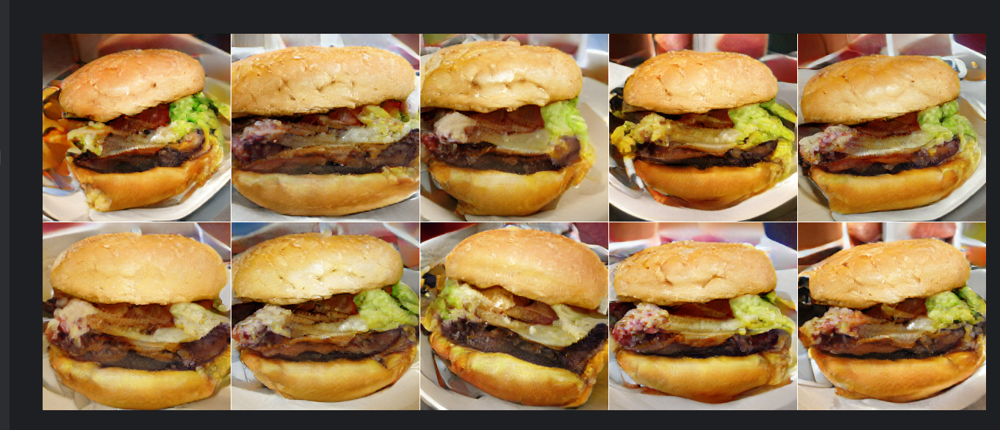

## Описание 2-го задания

Модель генерирует изображения по категории.

Сначала установите путь к модулю. По умолчанию мы загружаем генератор BigGAN-deep для изображений разме
ром 256x256 из https://tfhub.dev/deepmind/biggan-deep-256/1. Чтобы генерировать изображения 
размером 128x128 или 512x512 или использовать оригинальные генераторы BigGAN, закомментируйте 
активную ```module_path``` настройку и раскомментируйте одну из остальных.
Модель можно запускать как notebook, так и simple code.

Предварительно необходимо установить необходимые библиотеки, если они отсутствуют.
```pip install numpy tensorflow scipy```

Если вы запускаете код в IDE, то изображения будут сохраняться в директорию *image*.
Если вы запускаете код в notebook (предварительно скопировав его туда), то изображения будут пок
азаны после выполнения блока вызывающего функцию ```imshow()```, а также произойдет сохранение 
изображение в директорию *image*.

Формат наименованию готовых изображений - *image_[random_uuid].*

**Пример:**

| До генерации                   |        После генерации         |
|:-------------------------------|:------------------------------:|
|   |     |

#### Для запуска приложения:

```cd practice_2/polozov```

```python .\main.py```


#### Пример работы модели:



