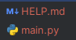
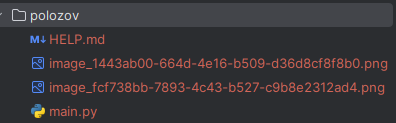

## Описание 2-го задания

Модель генерирует изображения по категории.

Сначала установите путь к модулю. По умолчанию мы загружаем генератор BigGAN-deep для изображений разме
ром 256x256 из https://tfhub.dev/deepmind/biggan-deep-256/1. Чтобы генерировать изображения 
размером 128x128 или 512x512 или использовать оригинальные генераторы BigGAN, закомментируйте 
активную ```module_path``` настройку и раскомментируйте одну из остальных.
Модель можно запускать как notebook, так и simple code.

Предварительно необходимо установить необходимые библиотеки, если они отсутствуют.
```pip install numpy tensorflow scipy streamlit```


Текущее сгенерированное изображение сохраняется в директория *image* проекта под названием - *sample.png*
В данный момент добавлено всего 3 категории изображений. При желании, количество категорий можно расширить.

#### Для запуска приложения:

```streamlit run .\practice_2\polozov\main.py```

Для генерации изображений, необходимо выбрать категорию (произойдет небольшая задержка) и далее нажать кнопку **generate.**


#### Пример работы модели:




