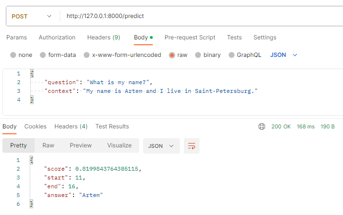
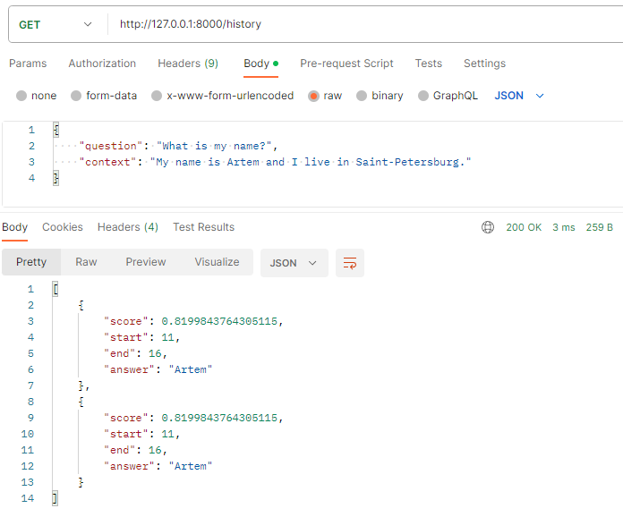

## Описание 3-го задания

Модель отвечает на вопрос исходя из контекста. Используется в основном английский язык.
Для работы с моделью необходимо выполнить HTTP-запросы на соответствующие endpoints REST-API.

1. После клонирования приложения перейдите на ветку **practice-3-polozov**

```git checkout practice-3-polozov```

2. Затем перейдите в директорию **practice-3**

```cd ./practice-3/```

3. Затем установите зависимости из файла requirements.txt

```pip install -r .\requirements.txt```

4. Запустите приложение

```uvicorn main:app```


Доступные endpoints (если разворачивает не локально, то **127.0.0.1** замените на адрес вашего хоста:
- **POST http://127.0.0.1:8000/predict** - получение предсказания модели на основании заданного вопроса и переданного контекста
- **GET http://127.0.0.1:8000/history** - список ранее заданных вопросов 

[UI FastAPI](http://127.0.0.1:8000/docs#/)

#### Пример работы модели:



## Git

В удаленном репозитории настроен линтер flake8.

**Убедитесь, что ваш код соответствует принципам PEP-8!**

Настроенный линтер находится в файле *.github/workflows/ci-polozov.yml*. 
Ознакомьтесь с настроенными правилами до коммита новых правок.

---

## 2ой семестр. Задание #3
#### Предлагаемые улучшения:

1. Вынести классы Item и HistoryData в отдельный .py-файл.
    Что этой даст? 
    - Улучшит читаемость кода и структуру
    - Немного уйдем в SOLID, а именно коснемся буквы "S"
2. Добавим комментарии к классам и методам
    Что этой даст? 
    - Улучшит читаемость кода и его понимание
    - Добавит "ускорение" вхождения других разработчиков в код
3. Добавить информацию в readme о том, что используются линтеры
    Что этой даст? 
    - Сообщение остальным разработчикам, что код локально до коммита стоит проверить. 
   Тем самым экономит время до выкатки фич.


